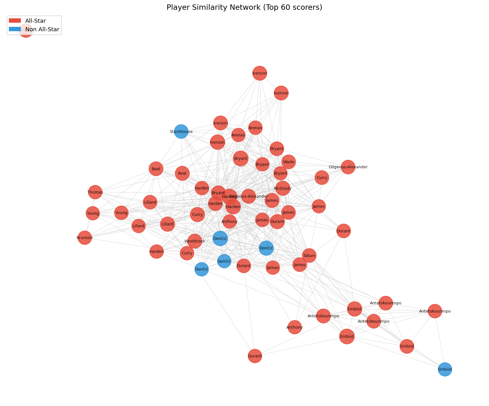
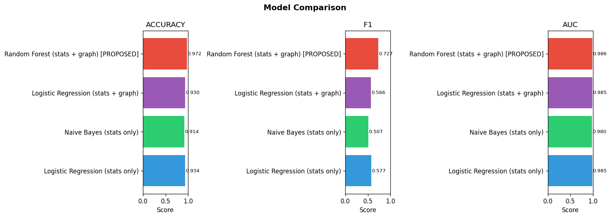
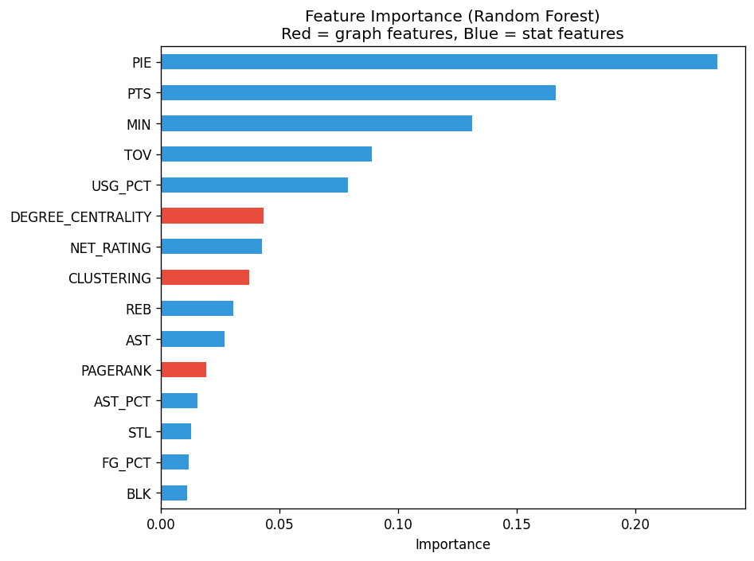
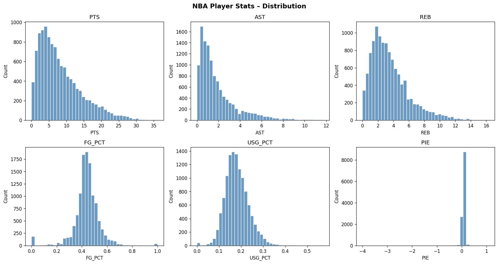
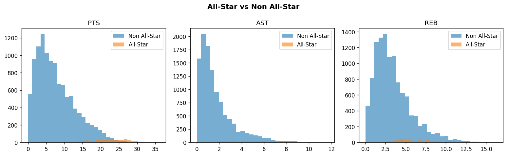

# NBA All-Star Prediction via Player Similarity Network

DSC 148 – Intro to Data Mining | Course Project | UCSD 2026

## Overview
This project builds a **player similarity graph** from NBA stats and uses graph features (PageRank, degree centrality, clustering coefficient) alongside traditional stats to predict whether a player will be named an NBA All-Star.

- **Dataset:** 11,659 player-seasons across 24 NBA seasons (2000–2024)
- **Task:** Binary classification — will this player be named an All-Star?
- **Best model:** Random Forest (stats + graph features) — 97.22% accuracy, 0.727 F1

## Results Summary

| Model | Accuracy | F1 | ROC-AUC |
|---|---|---|---|
| Logistic Regression (stats only) | 93.36% | 0.577 | 0.985 |
| Naive Bayes (stats only) | 91.40% | 0.507 | 0.980 |
| Logistic Regression (stats + graph) | 93.05% | 0.566 | 0.985 |
| **Random Forest (stats + graph)** | **97.22%** | **0.727** | **0.986** |

## Figures

### Player Similarity Network (Top 60 scorers)


### Model Comparison


### Feature Importance


### EDA — Stats Distribution


### EDA — All-Star vs Non All-Star


## Project Structure
```
nba-allstar-prediction/
├── README.md
├── requirements.txt
├── nba_allstar_labels.py     # Step 1: build All-Star labels
├── nba_project.py            # Step 2: main pipeline
├── demo.py                   # Step 3 (optional): interactive demo
├── data/
│   ├── allstar_labels.csv    # 500 All-Star records (2000–2024)
│   └── nba_player_stats.csv  # 11,659 player-seasons
└── figures/
    ├── eda_stats_distribution.png
    ├── eda_allstar_vs_not.png
    ├── player_similarity_graph.png
    ├── model_comparison.png
    └── feature_importance.png
```

## How to Run

### 1. Install dependencies
```bash
pip install -r requirements.txt
```

### 2. Build All-Star labels (run once)
```bash
python nba_allstar_labels.py
```

### 3. Run the full pipeline (~10 min first time)
```bash
python nba_project.py
```
Data is cached after the first run — subsequent runs are instant.

### 4. Optional: Interactive demo
```bash
python demo.py
```
Type any player name to get their All-Star prediction and 5 most similar players.

## Dataset
- **Source:** [nba_api](https://github.com/swar/nba_api) (NBA official stats)
- **Size:** 11,659 player-seasons, 2,367 unique players, 24 seasons (2000–2024)
- **All-Stars:** 466 selections (~4% of dataset)
- **Features:** PTS, AST, REB, STL, BLK, FG%, FG3%, FT%, TOV, GP, MIN, USG%, TS%, PIE, NET_RATING, AST%, REB%

## Model
1. Normalize player stat vectors using StandardScaler
2. Compute pairwise cosine similarity between all player-seasons
3. Build a graph: nodes = player-seasons, edges = similarity ≥ 0.92
4. Extract graph features: **PageRank**, **degree centrality**, **clustering coefficient**
5. Train Random Forest on stats + graph features
6. Compare against Logistic Regression and Naive Bayes baselines (stats only)

The key insight is that a player surrounded by other elite players in the similarity network is more likely to be an All-Star — the graph captures this "guilt by association" signal that raw stats alone miss.

## Author
Marvell Suhali — UCSD DSC 148, Spring 2026
